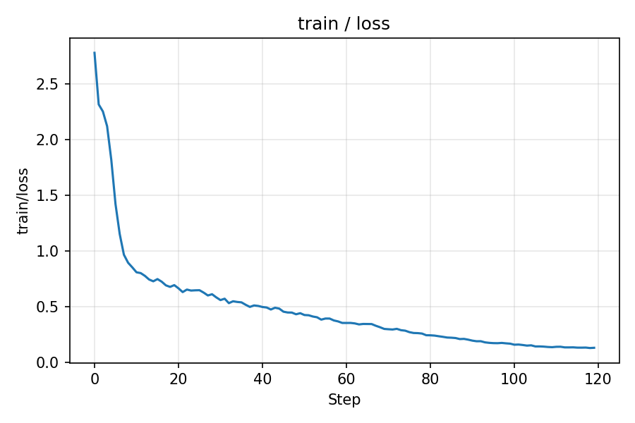
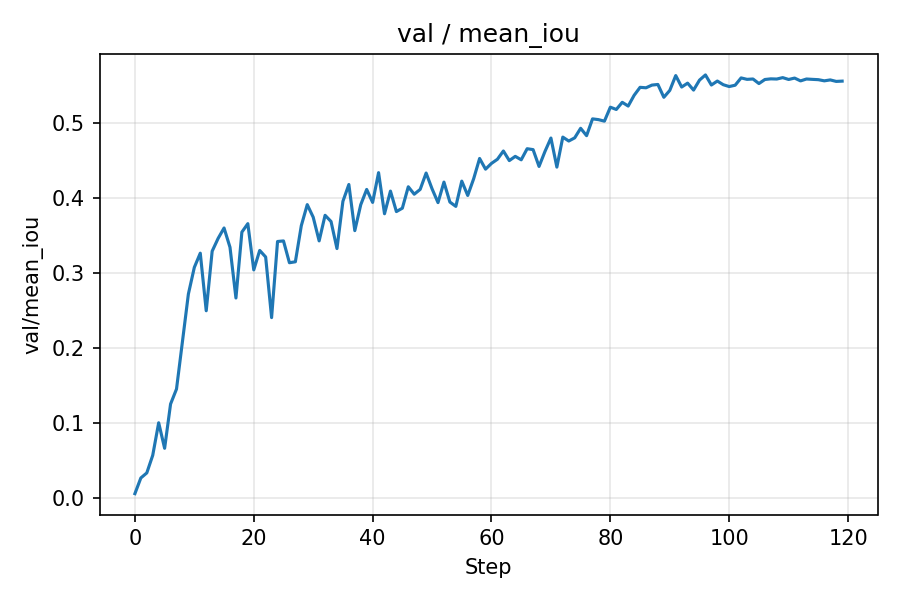
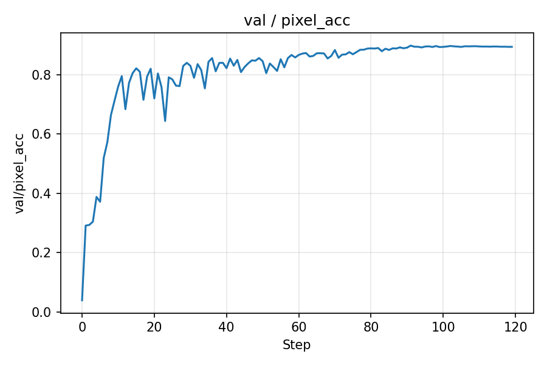
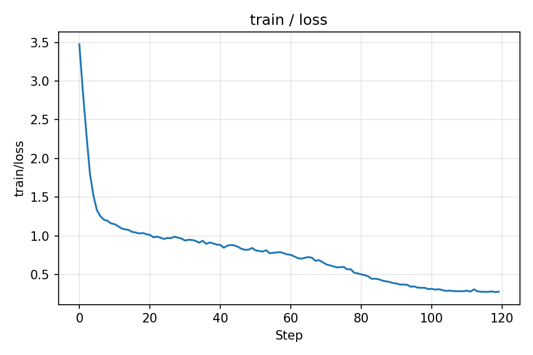
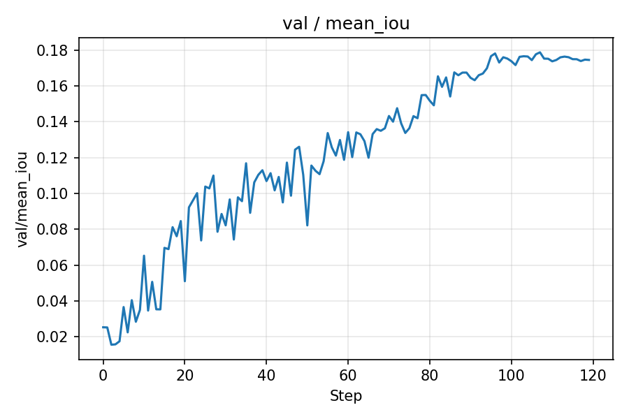
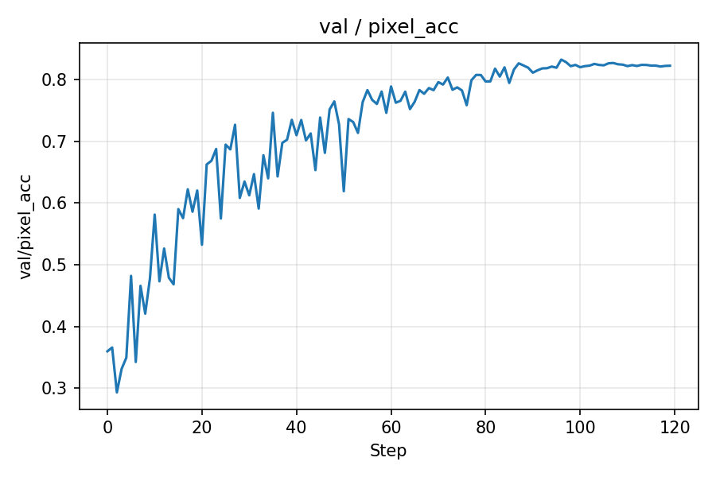
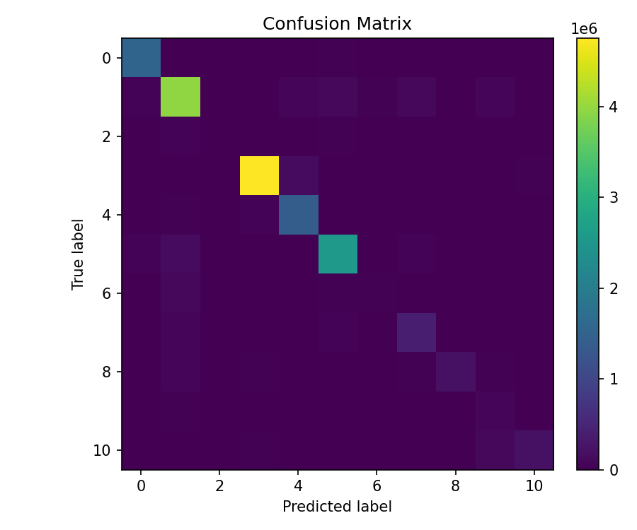
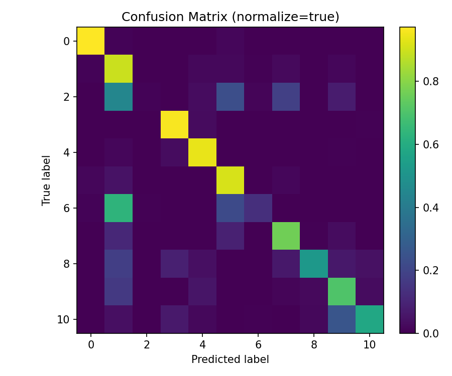
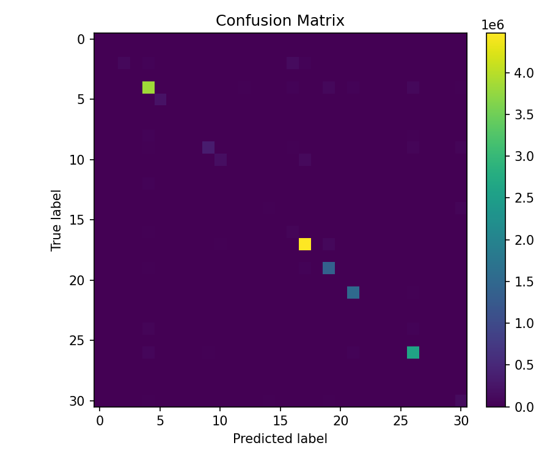
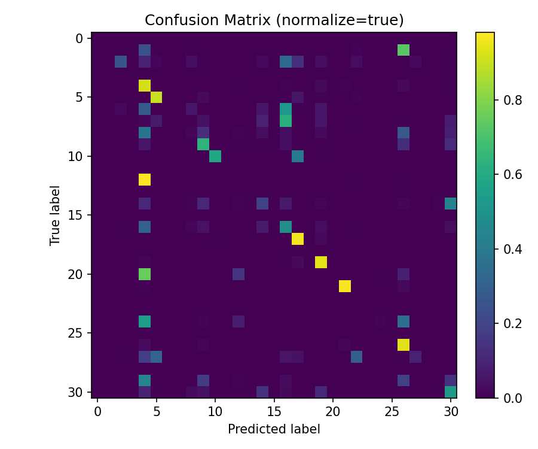

# 实验六：基于 SegNet 的街景分割

## 概述

本实验围绕场景语义分割任务展开，目标是将交通场景图像逐像素地分配到预定义类别。数据集采用 CamVid 的两种常见设置：一种是 11 类索引标签（`camvid11`），另一种是 32 类颜色标签映射（`camvid32`）。模型选用 SegNet 结构，并在编码器端使用 VGG16-BN 变体以继承 ImageNet 预训练能力，结合解码端的 MaxUnpool2d 借助池化索引还原空间分辨率。训练与评估过程中，记录关键标量到 TensorBoard，并从事件文件导出曲线图用于结果展示。

## 解决方案

本实验的核心方案由网络结构、损失函数与优化策略共同构成，配合必要的工程细节提升训练稳定性与泛化表现。

### 网络结构设计

SegNet 采用“编码器-解码器”架构。编码器以 VGG16-BN 风格堆叠若干卷积层，并使用 MaxPool2d(return_indices=True) 下采样；解码器通过 MaxUnpool2d 使用对应池化索引进行上采样，随后经对称卷积块逐步恢复空间信息，最后用 1×1 卷积映射到类别通道数。实现支持 `variant='vanilla'` 与 `variant='vgg16_bn'` 两种模式，后者可加载 ImageNet 预训练权重并可选择冻结编码器 BatchNorm 统计。

```python
# src/models/segnet.py (节选)
class SegNet(nn.Module):
    def forward(self, x: torch.Tensor) -> torch.Tensor:
        indices_list, sizes_list = [], []
        for block, pool in zip(self.enc_blocks, self.pool):
            x = block(x)
            sizes_list.append(x.size())
            x, indices = pool(x)
            indices_list.append(indices)
        for i, (block, unpool) in enumerate(zip(self.dec_blocks, self.unpool)):
            enc_size = sizes_list[-(i+1)]
            enc_indices = indices_list[-(i+1)]
            x = unpool(x, enc_indices, output_size=enc_size)
            x = block(x)
        return self.classifier(x)
```

### 损失函数设计

采用交叉熵损失，忽略像素标签中的 255 索引以规避无效区域对训练的干扰；支持按需注入类别权重（例如基于频率统计得到的 median frequency balancing），以缓解类别不均衡。

```python
# train.py (节选)
class_weights = None  # 可选：从配置载入并放置到 device
criterion = nn.CrossEntropyLoss(weight=class_weights, ignore_index=cfg.ignore_index)
```

### 优化器与调度器设计

优化器使用 Adam（lr=1e-3，weight_decay=1e-4），学习率调度采用 CosineAnnealingLR 按 epoch 退火。启用混合精度训练（AMP）与梯度裁剪（max_norm=1.0）以提高训练效率和数值稳定性；在训练循环中加入非有限损失的跳过逻辑，提升鲁棒性。

```python
# train.py (节选)
optimizer = torch.optim.Adam(model.parameters(), lr=cfg.lr, weight_decay=cfg.weight_decay)
scheduler = torch.optim.lr_scheduler.CosineAnnealingLR(optimizer, T_max=cfg.epochs)
scaler = torch.cuda.amp.GradScaler(enabled=(cfg.amp and device.type=='cuda'))
with torch.cuda.amp.autocast(enabled=(scaler is not None)):
    logits = model(imgs)
    loss = criterion(logits, masks)
scaler.scale(loss).backward()
scaler.unscale_(optimizer)
torch.nn.utils.clip_grad_norm_(model.parameters(), 1.0)
scaler.step(optimizer); scaler.update()
```

### 工程与实现细节（创新点）

本实现加入多项针对小数据集与工程稳定性的细节：编码器支持加载 VGG16-BN 预训练并可冻结 BN；数据管线同时兼容 CamVid 的索引标签与颜色标签两种形态，并在彩色标签缺失映射时给出可解释错误；训练循环在遇到全忽略像素批次与非有限损失时均进行安全跳过；评估阶段通过累计混淆矩阵稳定估计 mIoU 与像素精度；训练日志自动记录到 TensorBoard，并提供脚本从事件文件批量导出曲线图与 CSV，便于报告复现。

## 模型基本信息

下表总结了两组实验的关键配置与模型规模，参数量以可训练参数统计。

| 实验 | 类别数 | 变体 | 预训练编码器 | 冻结BN | 输入尺寸 | 可训练参数量 | Batch size | Epochs | 优化器 | 学习率 | 权重衰减 | 调度器 | AMP |
| --- | --- | --- | --- | --- | --- | --- | --- | --- | --- | --- | --- | --- | --- |
| CamVid-11 | 11 | VGG16-BN SegNet | 是 | 是 | 352×480 | 21,838,475 | 32 | 120 | Adam | 1e-3 | 1e-4 | Cosine | 开启 |
| CamVid-32 | 31 | VGG16-BN SegNet | 是 | 是 | 352×480 | 21,839,775 | 32 | 120 | Adam | 1e-3 | 1e-4 | Cosine | 开启 |

## 实验分析

本实验基于 CamVid 转换后的数据目录组织，其中 `camvid11` 直接使用灰度索引标签，`camvid32` 通过颜色映射文件将 RGB 标签转换为类别索引。输入被统一缩放至 352×480，并进行标准化与轻量随机增强。评价指标采用像素精度与平均交并比（mIoU），其中 mIoU 以累积混淆矩阵计算以减少波动。

### 训练与验证曲线（CamVid-11）







### 训练与验证曲线（CamVid-32）







### 量化结果

为便于复现与溯源，以下数值均由导出的 `scalars.csv` 直接统计得到，括号内的 step 表示达到该指标的 epoch 索引（从 0 开始）。

为便于阅读，本文的 mIoU 与像素精度统一以百分数展示（保留两位小数）。

| 实验 | 最终 val mIoU | 最终 val PixelAcc | 最佳 val mIoU | 最佳对应 PixelAcc | 最佳所在 step |
| --- | --- | --- | --- | --- | --- |
| CamVid-11 | 55.61% | 89.39% | 56.44% | 89.57% | 96 |
| CamVid-32 | 17.45% | 82.21% | 17.88% | 82.65% | 107 |

从结果上看，CamVid-11 的 mIoU 与像素精度明显高于 CamVid-32，符合 11 类任务相对难度较低、类别分布更均衡且训练目标更聚焦的直觉。CamVid-32 的曲线显示 mIoU 在后期缓慢上升并趋于稳定，进一步提升可能需要更强的数据增强、类别重加权或更长的训练调度。

### 可视化预测示例

下图展示了两种设置下的若干预测结果，直观体现模型在道路、建筑、天空等大结构上的分割能力，以及在行人、交通标志等小目标上的挑战。


### 混淆矩阵可视化与解读

下图展示两套实验的混淆矩阵（左：原始计数，右：按真实类别行归一化）。热力图中：
- 行表示真实类别，列表示预测类别；
- 对角线数值越大代表该类被正确识别的像素越多；
- 归一化图中的每一行加总为 1（忽略数值微小的浮点误差），因此更适合分析每类的“召回”表现与易混淆去向。

CamVid-11 的对角线整体更亮，说明主干结构（道路、天空、建筑）与中等规模目标（树、车辆）分割较为稳定；少量小目标（如交通标志、行人、自行车）在归一化矩阵中仍有向“道路/建筑”泄露的现象。CamVid-32 因类别粒度更细，类间分布更不均衡，原始矩阵中长尾类的对角元素明显偏小，归一化后可观察到这些小众类别像素更易被误分类为大面积背景类（道路、建筑、天空等），这与总体 mIoU 下滑一致。

#### CamVid-11





#### CamVid-32





## 总结

本实验基于 SegNet 在 CamVid 数据集上完成了 11 类与 32 类两套设置的训练与评估。通过引入 VGG16-BN 预训练编码器与冻结 BN、混合精度与梯度裁剪、鲁棒的忽略像素与异常损失处理，以及稳定的 mIoU 计算与可复现实验日志导出，获得了稳定可复现的训练曲线与评估指标。在相同训练轮数与优化设定下，11 类任务达到了更高的 mIoU 与像素精度；针对 32 类任务，建议后续在类别权重、数据增强、多尺度训练与更长调度方面进一步探索，并可以引入更强的解码器或注意力模块以提升对小目标与边界的刻画能力。
